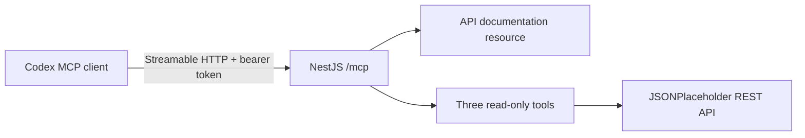

# NestJS MCP Learning Server

A deliberately small [Model Context Protocol (MCP)](https://modelcontextprotocol.io/) server built with NestJS. It teaches how a remote MCP server exposes documentation as a **resource** and safe operations as **tools**.

The server documents and reads from [JSONPlaceholder](https://jsonplaceholder.typicode.com/). Codex is the AI/MCP client, so this project needs no model SDK, API key, frontend, or database.

## Architecture



One MCP request follows this path:

1. Codex sends an MCP JSON-RPC request to `POST /mcp`.
2. `McpAccessGuard` checks the bearer token and any supplied `Origin`.
3. `McpController` creates a fresh server and Streamable HTTP transport.
4. `McpServerFactory` registers the resource and tools.
5. A selected tool calls `JsonPlaceholderService`.
6. The controller returns the MCP response and closes the server and transport.

Creating a fresh transport per request makes the server **stateless**. It does not issue session IDs or require sticky sessions.

## What the server exposes

### Resource

`jsonplaceholder://api-docs` is a short Markdown reference for the supported JSONPlaceholder endpoints. Resources provide context that a client can list and read without pretending the documentation is an action.

### Tools

| Tool | Input | Purpose |
| --- | --- | --- |
| `list_posts` | `userId?`, `limit = 3` | Lists at most 10 posts, optionally filtered by user. |
| `get_post` | `id` from 1–100 | Gets one post. |
| `get_user` | `id` from 1–10 | Gets one user. |

Every tool has a Zod input schema, structured output, a five-second upstream timeout, and MCP annotations marking it read-only, non-destructive, and idempotent. There is intentionally no generic URL caller and no write tool.

## Code map

```text
src/
├── main.ts                                  # Starts Nest on PORT
├── app.module.ts                            # Wires configuration and providers
├── health.controller.ts                     # Render/local health check
├── json-placeholder/
│   └── json-placeholder.service.ts          # Typed REST calls and timeout
└── mcp/
    ├── mcp-access.guard.ts                  # Token and Origin checks
    ├── mcp.controller.ts                    # Streamable HTTP transport
    └── mcp-server.factory.ts                # Resource and tool definitions
```

The official SDK is pinned to `@modelcontextprotocol/sdk@1.29.0`. Version 1 remains the stable production line while the SDK's version 2 is pre-release.

## Run locally

Requirements: Node.js 22 or newer and npm.

```bash
npm install
cp .env.example .env
openssl rand -hex 32
```

Copy the generated token into `MCP_AUTH_TOKEN` in `.env`, then start Nest:

```bash
npm run start:dev
```

The endpoints are:

- `http://localhost:3000/health`
- `http://localhost:3000/mcp`

Check health:

```bash
curl http://localhost:3000/health
```

Opening `/mcp` in a browser is not a valid test: MCP uses JSON-RPC over HTTP and this stateless server intentionally rejects `GET`. Use an MCP client.

## Test with MCP Inspector

Run the official Inspector without installing it globally:

```bash
npx @modelcontextprotocol/inspector
```

In the Inspector UI:

1. Select **Streamable HTTP**.
2. Enter `http://localhost:3000/mcp`.
3. Add header `Authorization: Bearer <your MCP_AUTH_TOKEN>`.
4. Connect and open the Resources and Tools tabs.
5. Read `jsonplaceholder://api-docs`, then call each tool.

If the Inspector sends an `Origin` header, add that exact origin to the comma-separated `MCP_ALLOWED_ORIGINS` value. The example allows `http://localhost:6274`.

## Automated verification

```bash
npm run lint
npm test
npm run build
```

The end-to-end test starts Nest on a random port and connects with the official `Client` and `StreamableHTTPClientTransport`. It verifies real MCP initialization, resources, tools, structured responses, input validation, authentication, and independent stateless clients. JSONPlaceholder is mocked only in automated tests so tests stay deterministic.

## Deploy free on Render

This repository includes a [Render Blueprint](./render.yaml). Render runs the normal Nest HTTP server; MCP does not require a special hosting product.

1. Push this repository to GitHub.
2. Open [Render's Blueprint page](https://dashboard.render.com/blueprints).
3. Create a Blueprint from the GitHub repository.
4. Choose the Free instance when prompted.
5. Set `MCP_AUTH_TOKEN` to a random 32-byte hex token. Do not commit it.
6. Deploy and copy the resulting `https://<service>.onrender.com` URL.

`render.yaml` configures:

- `npm ci && npm run build` as the build command;
- `npm run start:prod` as the start command;
- `/health` as the health check;
- Node.js 22;
- `MCP_AUTH_TOKEN` as a dashboard-supplied secret.

Render Free services sleep after 15 idle minutes. Wake the service before an MCP test:

```bash
until curl -fsS https://<service>.onrender.com/health; do sleep 5; done
```

Then repeat the Inspector steps with `https://<service>.onrender.com/mcp`.

## Connect the deployed server to Codex

Keep the token out of `config.toml`. Codex can read it from an environment variable:

```bash
read -s NEST_MCP_DEMO_TOKEN
export NEST_MCP_DEMO_TOKEN
launchctl setenv NEST_MCP_DEMO_TOKEN "$NEST_MCP_DEMO_TOKEN"

codex mcp add jsonplaceholder-learning \
  --url https://<service>.onrender.com/mcp \
  --bearer-token-env-var NEST_MCP_DEMO_TOKEN
```

The `launchctl` step makes the variable available to GUI applications started on macOS. Fully quit and reopen Codex after setting it.

Because Render can cold start slowly, add these non-secret settings to the generated server table in `~/.codex/config.toml`:

```toml
[mcp_servers.jsonplaceholder-learning]
url = "https://<service>.onrender.com/mcp"
bearer_token_env_var = "NEST_MCP_DEMO_TOKEN"
startup_timeout_sec = 90
tool_timeout_sec = 30
```

After restarting Codex, check **Settings → MCP servers** or type `/mcp`. Try:

- “Read the API documentation exposed by the JSONPlaceholder learning server.”
- “List the first three posts and summarize them.”
- “Get post 1, then find its author.”
- “Show only two posts belonging to user 3.”
- “Create a new post.” The correct response is that no write tool exists.

## Security boundaries

This is a temporary read-only learning server:

- Every `/mcp` request requires the shared bearer token.
- Requests with an `Origin` are accepted only when explicitly allowed.
- Tool inputs cannot supply arbitrary URLs.
- Result sizes and IDs are bounded.
- Upstream errors are replaced by a safe tool error.
- Secrets are excluded from Git and from MCP results.

A shared token is intentionally simpler than production authorization. For user-specific or sensitive data, implement the MCP OAuth 2.1 authorization model, per-user authorization, auditing, rate limiting, and secret rotation.

## Troubleshooting

- **`401 Unauthorized`**: Codex/Inspector is missing the token or it differs from Render.
- **`403 Forbidden`**: add the exact supplied Origin to `MCP_ALLOWED_ORIGINS`.
- **Codex says the server timed out**: wake `/health`, wait for `200`, and keep `startup_timeout_sec = 90`.
- **Browser shows 405 on `/mcp`**: expected; use Inspector or Codex instead of browser navigation.
- **Tool returns a retry message**: JSONPlaceholder timed out or returned an error.
- **Server does not appear in Codex**: fully restart Codex after adding the server and environment variable.

## Remove the experiment

```bash
codex mcp remove jsonplaceholder-learning
launchctl unsetenv NEST_MCP_DEMO_TOKEN
unset NEST_MCP_DEMO_TOKEN
```

Then suspend or delete the Render service. Rotating or deleting `MCP_AUTH_TOKEN` immediately prevents further MCP access.

## Primary references

- [MCP Streamable HTTP specification](https://modelcontextprotocol.io/specification/2025-11-25/basic/transports)
- [Official TypeScript SDK](https://github.com/modelcontextprotocol/typescript-sdk)
- [Official stateless Streamable HTTP example](https://github.com/modelcontextprotocol/typescript-sdk/blob/v1.x/src/examples/server/simpleStatelessStreamableHttp.ts)
- [MCP Inspector](https://modelcontextprotocol.io/docs/tools/inspector)
- [JSONPlaceholder guide](https://jsonplaceholder.typicode.com/guide/)
- [Render Free documentation](https://render.com/docs/free)
- [Codex MCP documentation](https://learn.chatgpt.com/docs/extend/mcp)
