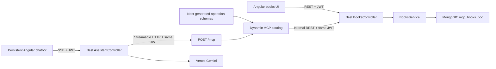

# Books MCP POC

A deliberately small application demonstrating how an existing NestJS API can be used manually from Angular and through an AI assistant connected over the Model Context Protocol.

The project is an Nx monorepo using:

- NestJS 11
- Angular 21 and Tailwind CSS 4
- MongoDB with Mongoose
- JWT authentication
- Nest OpenAPI schema generation
- MCP SDK 1.29.0 with stateless Streamable HTTP
- Google Vertex Gemini through the AI SDK

## Architecture



The important boundary is the existing authenticated REST API:

- REST controllers call it.
- Nest generates operation schemas from the registered controllers and DTOs.
- Those schemas automatically become MCP tool definitions.
- MCP tools call the existing REST routes over loopback HTTP with the same JWT.
- The normal Nest guards, pipes, interceptors, controllers, and services still execute.
- The assistant never queries MongoDB, invokes a controller method directly, or receives the JWT.

## Workspace

```text
apps/
├── api/                  Nest API, MCP server, and Gemini assistant
└── web/                  Angular books UI and floating chatbot
libs/
└── contracts/            Types shared by the API and browser
```

The old JSONPlaceholder learning example was replaced by the Books domain. Its stateless MCP transport pattern was retained.

## Features

### Manual Books API

| Method   | Endpoint          | Purpose                   |
| -------- | ----------------- | ------------------------- |
| `POST`   | `/api/auth/login` | Obtain an application JWT |
| `GET`    | `/api/auth/me`    | Read the current user     |
| `GET`    | `/api/books`      | Search/filter owned books |
| `GET`    | `/api/books/:id`  | Read one owned book       |
| `POST`   | `/api/books`      | Create a book             |
| `PATCH`  | `/api/books/:id`  | Update a book             |
| `DELETE` | `/api/books/:id`  | Delete a book             |

Swagger:

- `http://localhost:3000/api/docs`
- `http://localhost:3000/api/docs-json`

### MCP

Endpoint:

```text
POST http://localhost:3000/mcp
Authorization: Bearer <application JWT>
```

Tools:

- `auth_me`
- `books_list`
- `books_get`
- `books_create`
- `books_update`
- `books_remove`

The tool list is generated from Nest's controller and DTO metadata at startup.
Nest's OpenAPI generator supplies the schemas and also hosts the normal Swagger
UI for developers. The same document generates a lightweight Markdown resource
at `books://api-docs`, which the assistant reads only for API and capability
questions. Every JWT-protected operation becomes an MCP tool by default.
Infrastructure controllers stay out of the generated schema, while the
assistant uses `@McpExclude()` to prevent a recursive assistant-to-assistant
tool call.

Tool inputs mirror HTTP using `path`, `query`, and `body` objects. Tool handlers
can only call paths from the server-generated catalog; the model cannot provide
an arbitrary URL or token.

### Persistent assistant

The chatbot lives in the Angular application shell, so it remains mounted while navigating between `/books` and `/about`.

It supports:

- streamed responses;
- safe MCP tool status labels;
- Markdown, code, lists, and responsive tables;
- drag anywhere inside the viewport;
- minimize and maximize;
- persisted position, mode, and recent messages;
- cancellation;
- dynamically discovered MCP read and write tools available directly from chat;
- proactive JWT expiration detection and automatic return to login.

All generated MCP tools are available to Gemini on every turn. A write is
reported as successful only after its generated MCP tool and existing REST
endpoint return successfully.

## Local environment

Requirements:

- Node.js 22–24
- npm
- MongoDB Atlas connection
- Google Vertex service-account credentials

```bash
cp .env.example .env
```

The important variables are:

```dotenv
MONGODB_URI=
MONGODB_DB_NAME=mcp_books_poc
JWT_SECRET=
SEED_DEMO_USER=true
DEMO_USER_EMAIL=reader@example.com
DEMO_USER_PASSWORD=

GOOGLE_CREDS_B64=
GOOGLE_CLOUD_PROJECT=
GOOGLE_CLOUD_LOCATION=us-central1
GEMINI_MODEL=gemini-2.5-flash

MCP_URL=http://127.0.0.1:3000/mcp
INTERNAL_API_URL=http://127.0.0.1:3000
MCP_TOOL_TIMEOUT_MS=10000
```

`.env` is ignored by Git. Use a MongoDB credential restricted to the `mcp_books_poc` database when preparing a standalone Atlas account.

The currently prepared local environment seeds:

```text
Email:    reader@example.com
Password: BooksDemo123!
```

This is a disposable application login for local development, not a MongoDB cluster credential.

## Run

Install packages:

```bash
npm install
```

Run both applications:

```bash
npm run dev
```

Or run them separately:

```bash
npm run dev:api
npm run dev:web
```

Default URLs:

- Angular: `http://localhost:4200`
- Nest API: `http://localhost:3000/api`
- Swagger: `http://localhost:3000/api/docs`
- MCP: `http://localhost:3000/mcp`
- Health: `http://localhost:3000/health`

If port 4200 is occupied:

```bash
npm exec nx serve web -- --port=4300
```

## MCP Inspector

1. Log in through `/api/auth/login` and copy the returned application JWT.
2. Run:

```bash
npx @modelcontextprotocol/inspector
```

3. Select Streamable HTTP.
4. Enter `http://localhost:3000/mcp`.
5. Add `Authorization: Bearer <JWT>`.
6. List and call the six discovered tools.
7. List resources and read `books://api-docs` to inspect the generated API
   reference.

Opening `/mcp` in a normal browser intentionally returns `405`. It is a JSON-RPC endpoint, not a webpage.

## Automated verification

Static verification:

```bash
npm run lint
npm test
npm run build
```

With the API already running:

```bash
npm run verify:live
```

The live verifier logs in, connects with the official MCP client, reads the
generated documentation resource, lists tools, and performs a temporary
create/update/delete cycle that it cleans up.

## Suggested demonstration

1. Add **Clean Code** manually.
2. Ask: `List my books as a Markdown table.`
3. Ask: `Add The Pragmatic Programmer by Andrew Hunt and David Thomas.`
4. Confirm that the manual collection refreshes.
5. Ask: `Mark The Pragmatic Programmer as read.`
6. Edit a book manually and retrieve the updated value through chat.
7. Navigate to **How it works** while the chat remains open.
8. Minimize, restore, maximize, and drag the assistant.
9. Ask: `Explain which REST endpoints and MCP tools are available.`

## Render deployment

`render.yaml` defines two services from this monorepo:

- `penny-books-mcp-api-7f29`: NestJS, Gemini orchestration, and `/mcp`;
- `penny-books-mcp-web-7f29`: the Angular static site.

The hosted API and local development use the same dedicated POC Atlas database:

```dotenv
MONGODB_DB_NAME=mcp_books_poc
```

Render prompts for these secrets during the initial Blueprint creation:

- `MONGODB_URI`
- `DEMO_USER_PASSWORD`
- `GOOGLE_CREDS_B64`
- `GOOGLE_CLOUD_PROJECT`

The Angular build receives the public API URL through `API_URL`. The generated
`runtime-config.js` keeps local development on same-origin `/api` while pointing
the hosted static site to the Render API.

The API service binds to port `10000`, calls its authenticated REST API over
`INTERNAL_API_URL=http://127.0.0.1:10000`, and limits each generated MCP tool
call with `MCP_TOOL_TIMEOUT_MS=10000`. The browser origin is restricted to the
deployed Angular URL.

## Deliberately excluded

To keep the learning project readable, it does not include:

- roles or organizations;
- conversation collections;
- refresh tokens;
- file attachments;
- arbitrary URL, REST, or MongoDB tools;
- production OAuth for external MCP clients.

This Render deployment is still a learning POC. A production external MCP
server would need a dedicated OAuth and audience design rather than reusing this
application JWT unchanged.

## References

- [MCP Streamable HTTP specification](https://modelcontextprotocol.io/specification/2025-11-25/basic/transports)
- [MCP tools specification](https://modelcontextprotocol.io/specification/2025-11-25/server/tools)
- [MCP TypeScript SDK](https://ts.sdk.modelcontextprotocol.io/server)
- [AI SDK MCP client](https://ai-sdk.dev/docs/ai-sdk-core/mcp-tools)
- [AI SDK Google Vertex provider](https://ai-sdk.dev/providers/ai-sdk-providers/google-vertex)
- [NestJS MongoDB](https://docs.nestjs.com/techniques/mongodb)
- [NestJS Swagger](https://docs.nestjs.com/openapi/introduction)
